# 📘 Panduan Teknis Pengembangan Frontend — UKSTM-32 Digital Invitation System

> **Versi Dokumen:** 1.0  
> **Terakhir Diperbarui:** 20 Mei 2026  
> **Peran Penulis:** Senior System Analyst & Technical Writer  
> **Target Pembaca:** Tim Pengembang Frontend

---

## Daftar Isi

1. [Arsitektur dan Ekosistem Aplikasi](#1-arsitektur-dan-ekosistem-aplikasi)
2. [Alur Autentikasi dan Profil Pengguna](#2-alur-autentikasi-dan-profil-pengguna)
3. [Alur Manajemen Acara & Jadwal Acara (Rundown)](#3-alur-manajemen-acara--jadwal-acara-rundown)
4. [Alur Manajemen Tamu & Validasi Gerbang Impor](#4-alur-manajemen-tamu--validasi-gerbang-impor)
5. [Alur Sistem Siaran Pesan (Broadcast & Follow-up)](#5-alur-sistem-siaran-pesan-broadcast--follow-up)
6. [Alur RSVP & Konfirmasi Kehadiran Tamu](#6-alur-rsvp--konfirmasi-kehadiran-tamu)
7. [Alur Validasi Operasional di Lapangan](#7-alur-validasi-operasional-di-lapangan)
8. [Alur Statistik & Unduh Laporan](#8-alur-statistik--unduh-laporan)
9. [Fitur Tambahan & Alur Pelengkap](#9-fitur-tambahan--alur-pelengkap)

---

## 1. Arsitektur dan Ekosistem Aplikasi

Sistem UKSTM-32 terdiri dari dua aplikasi utama yang bekerja secara sinergis: **Aplikasi Utama (Main/Backend)** berbasis NestJS yang menangani seluruh logika bisnis dan menyajikan REST API, serta **Pemroses Antrean (Worker)** berbasis BullMQ yang bertanggung jawab atas pengiriman pesan WhatsApp melalui pustaka Baileys. Kedua komponen terhubung melalui **Redis** sebagai perantara antrean pesan (message broker) dan **PostgreSQL** sebagai basis data bersama.

### 1.1 Diagram Arsitektur Sistem

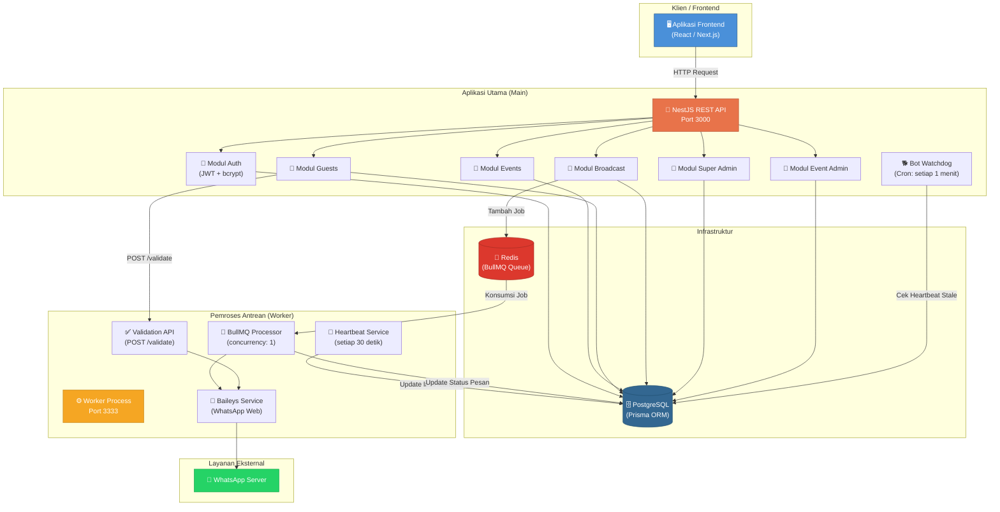

### 1.2 Tabel Komponen Utama

| Komponen | Teknologi | Port | Fungsi Utama |
|---|---|---|---|
| **Main API** | NestJS + TypeScript | `3000` | REST API, logika bisnis, autentikasi |
| **Worker** | Node.js + BullMQ | `3333` | Pengiriman pesan WhatsApp, validasi nomor |
| **Database** | PostgreSQL + Prisma | `5432` | Penyimpanan data persisten |
| **Message Broker** | Redis + BullMQ | `6379` | Antrean pekerjaan pengiriman pesan |
| **WhatsApp** | Baileys (Web Socket) | — | Koneksi ke WhatsApp Web |

### 1.3 Alur Komunikasi Antar Komponen

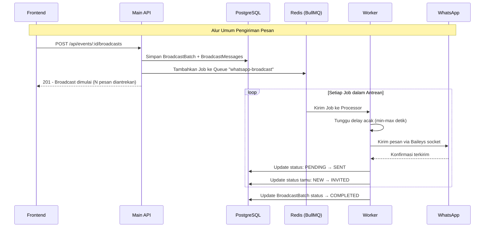

---

## 2. Alur Autentikasi dan Profil Pengguna

Sistem autentikasi menggunakan JSON Web Token (JWT) dengan mekanisme *access token* dan *refresh token*. Kata sandi disimpan menggunakan algoritma hashing **bcrypt** dengan salt rounds 12.

### 2.1 Peran dan Hak Akses (Role-Based Access Control)

Sistem memiliki tiga jenjang peran pengguna yang diatur melalui `enum Role`:

| Peran | Kode Enum | Hak Akses |
|---|---|---|
| **Super Admin** | `SUPER_ADMIN` | Mengelola seluruh pengguna, mengubah peran, mengelola koneksi bot WhatsApp, melihat semua data |
| **User (Pemilik Acara)** | `USER` | Membuat dan mengelola acara miliknya sendiri (maks. 10), mengelola tamu, mengirim siaran, mendaftarkan Event Admin untuk acaranya, mengekspor laporan |
| **Event Admin** | `EVENT_ADMIN` | Operasional di lapangan (check-in, klaim snack) hanya untuk acara yang ditugaskan, melihat statistik acara |

```mermaid
graph TD
    SA["👑 SUPER_ADMIN"] --> |"Kelola Pengguna"| UM["Manajemen Pengguna"]
    SA --> |"Kelola Bot"| BM["Manajemen Bot WhatsApp"]
    SA --> |"Assign Event Admin"| AEA["Penugasan Event Admin"]

    US["🧑 USER"] --> |"Maks. 10 acara"| EM["Manajemen Acara"]
    US --> |"CRUD Tamu"| GM["Manajemen Tamu"]
    US --> |"Kirim Pesan"| BC["Sistem Siaran"]
    US --> |"Assign Admin"| AEA2["Penugasan Event Admin"]
    US --> |"Ekspor Laporan"| RP["Unduh Laporan Excel"]

    EA["🎫 EVENT_ADMIN"] --> |"QR / Manual"| CI["Check-in Kehadiran"]
    EA --> |"QR / Manual"| SN["Klaim Snack"]
    EA --> |"Lihat Data"| ST["Statistik Acara"]

    style SA fill:#FF6B6B,stroke:#CC5555,color:#fff
    style US fill:#4ECDC4,stroke:#3BA89F,color:#fff
    style EA fill:#FFE66D,stroke:#CCB856,color:#000
```

### 2.2 Pendaftaran Akun (Register)

Pengguna baru mendaftar melalui endpoint publik. Sistem memvalidasi keunikan email, melakukan normalisasi nomor ponsel (format `08xx` otomatis dikonversi ke `+628xx`), dan langsung mengembalikan token akses.

**Endpoint:** `POST /api/auth/register`

**Request Body:**

```json
{
  "name": "John Doe",
  "email": "john@example.com",
  "phone": "081234567890",
  "password": "SecureP@ss123"
}
```

**Response Sukses (201):**

```json
{
  "success": true,
  "statusCode": 201,
  "message": "Registration successful",
  "data": {
    "user": {
      "id": "uuid-xxx",
      "name": "John Doe",
      "email": "john@example.com",
      "phone": "+6281234567890",
      "role": "USER"
    },
    "accessToken": "eyJhbGciOi...",
    "refreshToken": "eyJhbGciOi..."
  }
}
```

**Response Gagal (409):**

```json
{
  "success": false,
  "statusCode": 409,
  "message": "Email already exists",
  "error": {
    "code": "USER_002",
    "details": [{ "field": "email", "message": "Email already exists" }]
  }
}
```

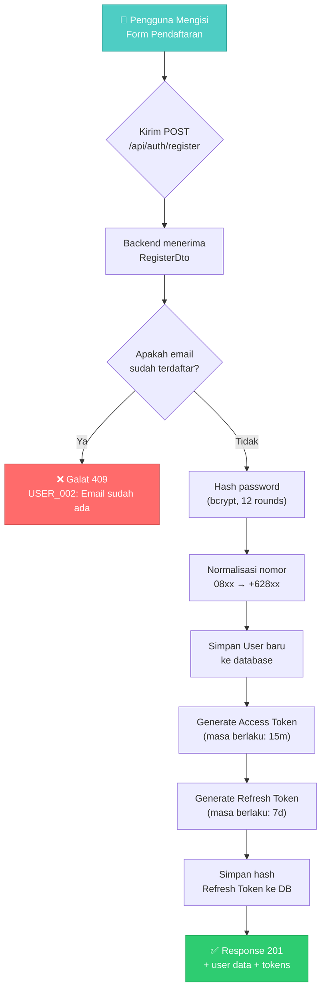

### 2.3 Masuk (Login)

Pengguna yang sudah memiliki akun dapat masuk menggunakan email dan kata sandi. Khusus untuk peran `EVENT_ADMIN`, sistem juga mengembalikan `eventId` dari acara yang ditugaskan kepadanya.

**Endpoint:** `POST /api/auth/login`

**Request Body:**

```json
{
  "email": "john@example.com",
  "password": "SecureP@ss123"
}
```

**Response Sukses (200):**

```json
{
  "success": true,
  "statusCode": 200,
  "message": "Login successful",
  "data": {
    "user": {
      "id": "uuid-xxx",
      "name": "John Doe",
      "email": "john@example.com",
      "phone": "+6281234567890",
      "role": "USER",
      "eventId": null
    },
    "accessToken": "eyJhbGciOi...",
    "refreshToken": "eyJhbGciOi..."
  }
}
```

> **Catatan Penting untuk Frontend:**  
> Jika `user.role === "EVENT_ADMIN"`, gunakan `user.eventId` yang dikembalikan oleh response login untuk navigasi langsung ke halaman operasional acara. Field `eventId` bernilai `null` untuk peran `USER` dan `SUPER_ADMIN`.

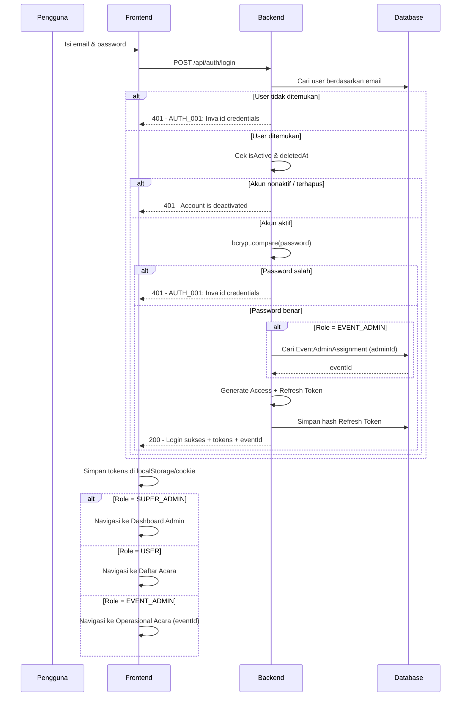

### 2.4 Ganti Kata Sandi (Change Password)

Fitur ini memerlukan autentikasi (Bearer Token). Pengguna **wajib** memasukkan kata sandi lama sebagai validasi keamanan sebelum kata sandi baru disimpan.

**Endpoint:** `PUT /api/auth/password`  
**Header:** `Authorization: Bearer <accessToken>`

**Request Body:**

```json
{
  "oldPassword": "LamaSekali123",
  "newPassword": "BaruDanKuat456"
}
```

**Response Sukses (200):**

```json
{
  "success": true,
  "statusCode": 200,
  "message": "Kata sandi berhasil diubah"
}
```

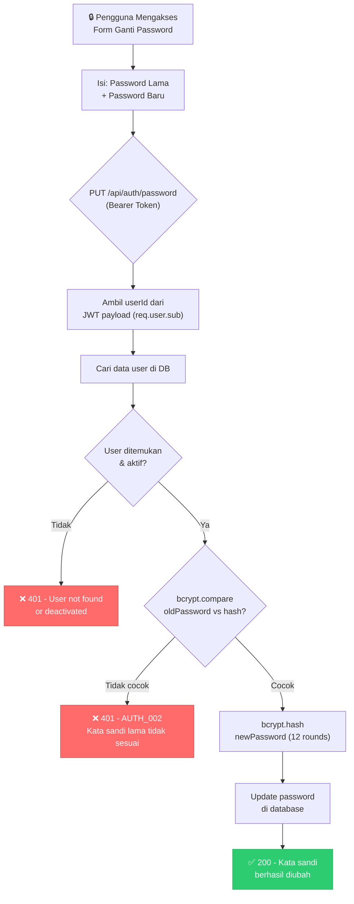

---

## 3. Alur Manajemen Acara & Jadwal Acara (Rundown)

### 3.1 Pembuatan Acara Baru

Setiap pengguna dengan peran `USER` dapat membuat acara baru. Sistem membatasi maksimal **10 acara aktif** per pengguna. Penghapusan acara menggunakan mekanisme *soft delete* (kolom `deletedAt`).

**Endpoint:** `POST /api/events`  
**Header:** `Authorization: Bearer <accessToken>`

**Request Body:**

```json
{
  "title": "Wisuda SMK Telkom Malang 2026",
  "eventDate": "2026-07-15T08:00:00.000Z",
  "endDate": "2026-07-15T15:00:00.000Z",
  "venue": "Aula Utama SMK Telkom Malang",
  "description": "Upacara wisuda angkatan 32"
}
```

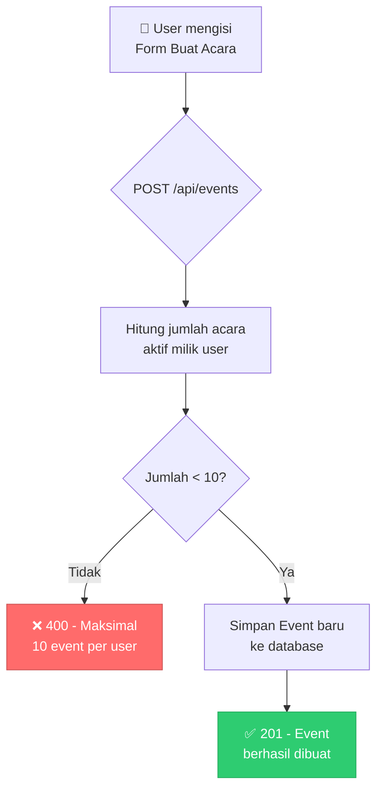

### 3.2 Daftar Endpoint Manajemen Acara

| Metode | Endpoint | Deskripsi | Guard |
|---|---|---|---|
| `POST` | `/api/events` | Buat acara baru | JwtAuth |
| `GET` | `/api/events` | Ambil daftar acara aktif milik user | JwtAuth |
| `GET` | `/api/events/trash` | Ambil daftar acara yang dihapus | JwtAuth |
| `GET` | `/api/events/:id` | Ambil detail satu acara | JwtAuth |
| `PATCH` | `/api/events/:id` | Perbarui data acara | JwtAuth + EventOwner |
| `DELETE` | `/api/events/:id` | Soft-delete acara | JwtAuth |

### 3.3 Manajemen Event Admin oleh Pemilik Acara

Pemilik acara (User) dapat mendaftarkan seorang Event Admin untuk acaranya. Proses ini membuat akun pengguna baru dengan peran `EVENT_ADMIN` dan langsung menautkannya ke acara terkait melalui tabel `EventAdminAssignment`.

**Endpoint:** `POST /api/events/:eventId/admins`

**Request Body:**

```json
{
  "name": "Admin Wisuda",
  "email": "admin.wisuda@example.com",
  "phone": "081234567899",
  "password": "AdminPass123"
}
```

| Metode | Endpoint | Deskripsi |
|---|---|---|
| `POST` | `/api/events/:eventId/admins` | Daftarkan Event Admin baru |
| `GET` | `/api/events/:eventId/admins` | Lihat daftar Event Admin aktif |
| `GET` | `/api/events/:eventId/admins/trash` | Lihat Event Admin yang dihapus |
| `PATCH` | `/api/events/:eventId/admins/:adminId` | Perbarui data Event Admin |
| `DELETE` | `/api/events/:eventId/admins/:adminId` | Soft-delete Event Admin |

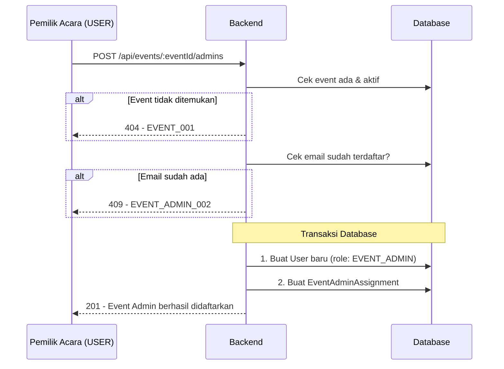

### 3.4 Jadwal Acara (Rundown) — Logika Urutan Pintar

Sistem rundown menggunakan mekanisme **Auto-Increment** pada kolom `order` dengan constraint `@@unique([eventId, order])`. Setiap rundown baru yang ditambahkan akan otomatis mendapatkan nomor urut berikutnya (nilai `MAX(order) + 1`), sehingga mencegah nomor urut ganda dalam satu acara. Nilai `order` yang dikirim oleh klien akan **diabaikan** saat pembuatan dan selalu ditentukan oleh server.

**Endpoint Rundown:**

| Metode | Endpoint | Deskripsi |
|---|---|---|
| `POST` | `/api/events/:eventId/rundowns` | Tambah rundown baru (order otomatis) |
| `GET` | `/api/events/:eventId/rundowns` | Ambil daftar rundown (terurut naik) |
| `PATCH` | `/api/events/:eventId/rundowns/:rundownId` | Perbarui rundown |
| `DELETE` | `/api/events/:eventId/rundowns/:rundownId` | Hapus rundown |

**Request Body (POST):**

```json
{
  "title": "Pembukaan",
  "description": "Sambutan MC dan doa pembuka",
  "startTime": "2026-07-15T08:00:00.000Z",
  "endTime": "2026-07-15T08:30:00.000Z"
}
```

```mermaid
graph TD
    subgraph "Alur Pembuatan Rundown (POST)"
        A["📋 User menambah<br/>Rundown baru"] --> B{"POST /api/events<br/>/:eventId/rundowns"}
        B --> C["Cek event ada<br/>& aktif"]
        C --> D["Hitung MAX(order)<br/>untuk eventId ini"]
        D --> E["newOrder =<br/>MAX(order) + 1"]
        E --> F["Simpan rundown<br/>dengan order = newOrder"]
        F --> G["✅ 201 - Rundown<br/>berhasil dibuat"]
    end

    subgraph "Alur Perubahan Urutan (PATCH)"
        H["📝 User mengubah<br/>urutan rundown"] --> I{"PATCH rundowns<br/>/:rundownId"}
        I --> J{"order berubah<br/>dari sebelumnya?"}
        J -->|Tidak| K["Update field lain<br/>tanpa geser urutan"]
        J -->|Ya| L{"Ada konflik<br/>di order baru?"}
        L -->|Tidak| M["Langsung update<br/>order ke nilai baru"]
        L -->|Ya| N["Geser semua rundown<br/>≥ order baru (+1)"]
        N --> M
        K --> O["✅ 200 - Rundown<br/>berhasil diupdate"]
        M --> O
    end

    subgraph "Alur Penghapusan (DELETE)"
        P["🗑️ User menghapus<br/>rundown"] --> Q{"DELETE rundowns<br/>/:rundownId"}
        Q --> R["Hapus rundown<br/>dari database"]
        R --> S["Kompaksi: Geser urutan<br/>semua rundown setelahnya (-1)"]
        S --> T["✅ 200 - Rundown<br/>berhasil dihapus"]
    end

    style G fill:#2ECC71,stroke:#27AE60,color:#fff
    style O fill:#2ECC71,stroke:#27AE60,color:#fff
    style T fill:#2ECC71,stroke:#27AE60,color:#fff
```

> **Catatan Penting:** Ketika sebuah rundown dihapus, sistem secara otomatis melakukan **kompaksi** — seluruh rundown yang memiliki `order` lebih besar dari item yang dihapus akan dikurangi 1, sehingga tidak ada celah dalam urutan.

---

## 4. Alur Manajemen Tamu & Validasi Gerbang Impor

Modul tamu merupakan inti dari sistem undangan digital. Setiap tamu dikaitkan dengan satu acara melalui `eventId` dan memiliki kode hash unik 12 karakter (`hashCode`) yang dihasilkan menggunakan pustaka **nanoid** untuk membuat tautan undangan.

### 4.1 Siklus Hidup Status Tamu (GuestStatus)

```mermaid
stateDiagram-v2
    [*] --> NEW : Tamu baru didaftarkan
    NEW --> INVITED : Pesan siaran berhasil terkirim
    INVITED --> OPENED : Tamu membuka tautan undangan
    NEW --> OPENED : Tamu membuka tautan (tanpa broadcast)
    OPENED --> GOING : RSVP: attendance = true
    OPENED --> NOT_GOING : RSVP: attendance = false
    GOING --> NOT_GOING : Ubah RSVP (maks 3x)
    NOT_GOING --> GOING : Ubah RSVP (maks 3x)
    
    note right of NEW : Status awal
    note right of INVITED : Diubah oleh Worker
    note right of OPENED : Diubah saat GET /invitation/:hash
    note right of GOING : Siap check-in, QR tersedia
```

### 4.2 Impor Tunggal — Validasi Real-time (POST)

Saat mendaftarkan satu tamu, sistem melakukan validasi nomor ponsel secara **real-time** ke Worker WhatsApp melalui internal HTTP API (`POST http://localhost:3333/validate`). Jika nomor tidak terdaftar di WhatsApp, pendaftaran **ditolak** dengan kode galat 400.

**Endpoint:** `POST /api/events/:eventId/guests`

**Request Body:**

```json
{
  "name": "Budi Santoso",
  "phone": "081234567890",
  "groupId": "uuid-group-xxx",
  "notes": "Orang tua wali murid"
}
```

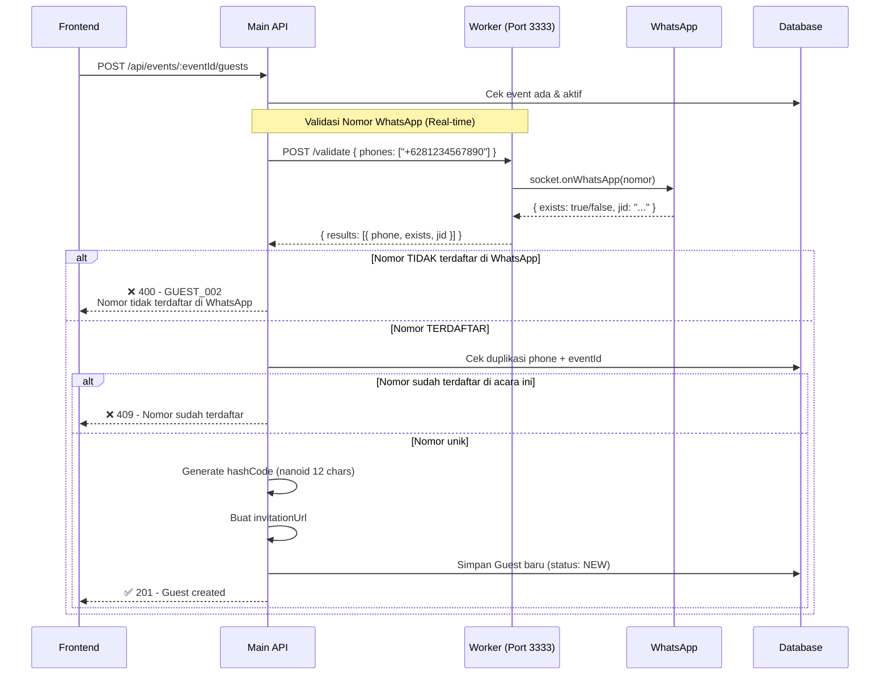

### 4.3 Impor Massal — Penyaringan Baris demi Baris (Excel Import)

Impor massal menerima berkas Excel (`.xlsx` / `.xls`, maks. 5 MB) dengan format kolom: **Nama | No. Handphone | Grup**. Sistem memproses setiap baris secara berurutan dengan mekanisme penyaringan berlapis.

**Endpoint:** `POST /api/events/:eventId/guests/import`  
**Content-Type:** `multipart/form-data`  
**Field:** `file` (berkas Excel)

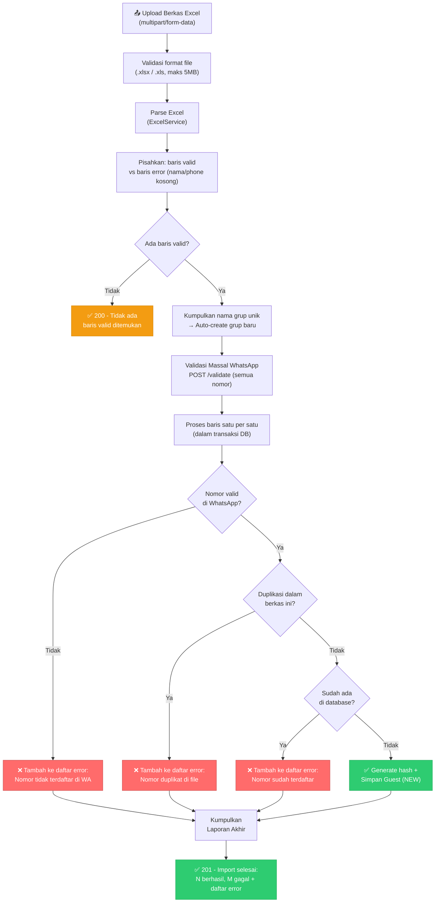

**Response Sukses (201):**

```json
{
  "success": true,
  "statusCode": 201,
  "message": "Import completed: 45 created, 5 failed",
  "data": {
    "success": 45,
    "failed": 5,
    "errors": [
      { "row": 3, "message": "Mobile number +6281xxx is not registered on WhatsApp." },
      { "row": 7, "message": "Mobile number +6282xxx is duplicated in this file (already seen for \"Andi\")." },
      { "row": 12, "message": "Mobile number +6283xxx has been registered as Siti's guest at this event." }
    ]
  }
}
```

> **Catatan untuk Frontend:** Tampilkan daftar `errors` dalam tabel laporan yang jelas, sertakan nomor baris (`row`) agar pengguna dapat melacak kembali ke berkas aslinya. Grup yang belum ada akan **otomatis dibuat** oleh sistem.

### 4.4 Pembaruan Nomor Ponsel (PUT) — Reset Status Otomatis

Ketika nomor ponsel tamu diperbarui dan berbeda dari nomor sebelumnya, sistem secara otomatis **mereset status tamu** menjadi `NEW`. Logika ini penting karena nomor baru belum pernah menerima undangan.

**Endpoint:** `PUT /api/events/:eventId/guests/:id`

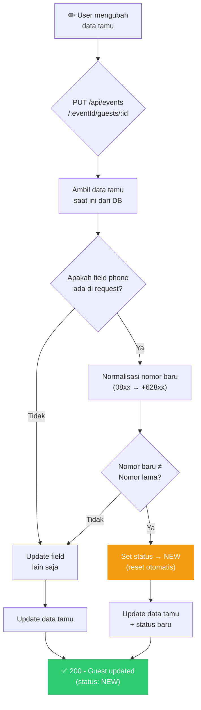

### 4.5 Daftar Endpoint Tamu Lengkap

| Metode | Endpoint | Deskripsi | Guard |
|---|---|---|---|
| `POST` | `/api/events/:eventId/guests` | Tambah tamu tunggal (validasi WA) | EventOwner |
| `POST` | `/api/events/:eventId/guests/import` | Impor massal dari Excel | EventOwner |
| `GET` | `/api/events/:eventId/guests` | Daftar tamu (filter: status, groupId) | EventOwner |
| `GET` | `/api/events/:eventId/guests/trash` | Daftar tamu yang dihapus | EventOwner |
| `GET` | `/api/events/:eventId/guests/:id` | Detail satu tamu | EventOwner |
| `PUT` | `/api/events/:eventId/guests/:id` | Perbarui data tamu | EventOwner |
| `DELETE` | `/api/events/:eventId/guests/:id` | Soft-delete tamu | EventOwner |

---

## 5. Alur Sistem Siaran Pesan (Broadcast & Follow-up)

Sistem siaran pesan mengelola pengiriman undangan WhatsApp secara massal menggunakan arsitektur antrean. Pesan dikirim satu per satu (concurrency: 1) dengan jeda acak antar pesan untuk mencegah pemblokiran oleh WhatsApp.

### 5.1 Sistem Templat Pesan

Templat pesan mendukung variabel dinamis yang akan diganti dengan data asli setiap tamu:

| Variabel | Diganti Dengan | Contoh Hasil |
|---|---|---|
| `{{ name }}` | Nama tamu | Budi Santoso |
| `{{ event_title }}` | Judul acara | Wisuda SMK Telkom 2026 |
| `{{ event_date }}` | Tanggal acara (format Indonesia) | Selasa, 15 Juli 2026 |
| `{{ invitation_link }}` | URL undangan unik tamu | <https://app.com/invitation/abc123def456> |

### 5.2 Fitur Pratayang (Preview)

Fitur pratayang memungkinkan pengguna melihat bagaimana pesan akan terlihat setelah variabel diisi dengan data asli. Sistem mengambil **3 tamu** berstatus `NEW` sebagai contoh. Jika tidak ada tamu yang memenuhi syarat, sistem menampilkan contoh menggunakan data dummy.

**Endpoint:** `GET /api/events/:eventId/broadcasts/preview`

**Query Parameters:**

| Parameter | Wajib | Deskripsi |
|---|---|---|
| `targetType` | Ya | `ALL` atau `GROUP` |
| `groupId` | Jika GROUP | ID grup target |
| `messageTemplate` | Ya | Teks templat pesan |

**Response (200):**

```json
{
  "success": true,
  "statusCode": 200,
  "message": "Preview generated",
  "data": {
    "previews": [
      {
        "name": "Budi Santoso",
        "phone": "+6281234567890",
        "message": "Yth. Budi Santoso, Anda diundang ke Wisuda SMK Telkom 2026 pada Selasa, 15 Juli 2026. Buka undangan: https://app.com/invitation/abc123"
      }
    ]
  }
}
```

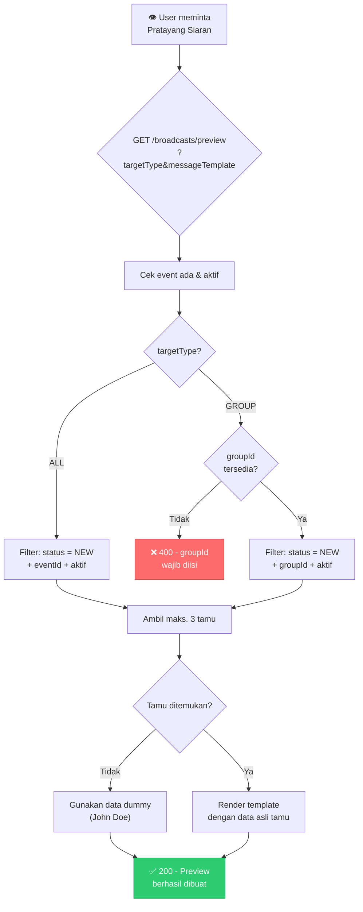

### 5.3 Pengiriman Siaran — Pencegahan Pengiriman Ganda (Spam Lock)

Sistem menerapkan **Concurrency Lock** — jika terdapat siaran dengan status `PROCESSING` yang masih aktif untuk acara yang sama, pembuatan siaran baru akan **ditolak** (409 Conflict).

**Endpoint:** `POST /api/events/:eventId/broadcasts`  
**Content-Type:** `multipart/form-data` atau `application/json`

**Request Body:**

```json
{
  "messageTemplate": "Yth. {{ name }}, Anda diundang ke {{ event_title }} pada {{ event_date }}. Buka undangan: {{ invitation_link }}",
  "targetType": "ALL",
  "groupId": null,
  "mediaUrl": null
}
```

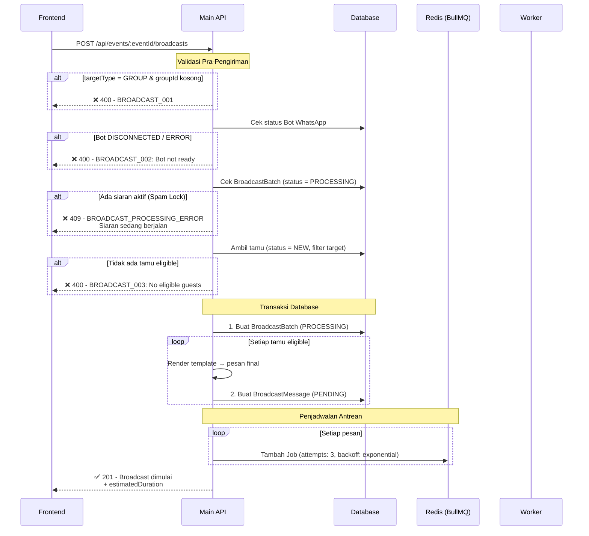

### 5.4 Siklus Hidup Status Siaran (BroadcastBatch)

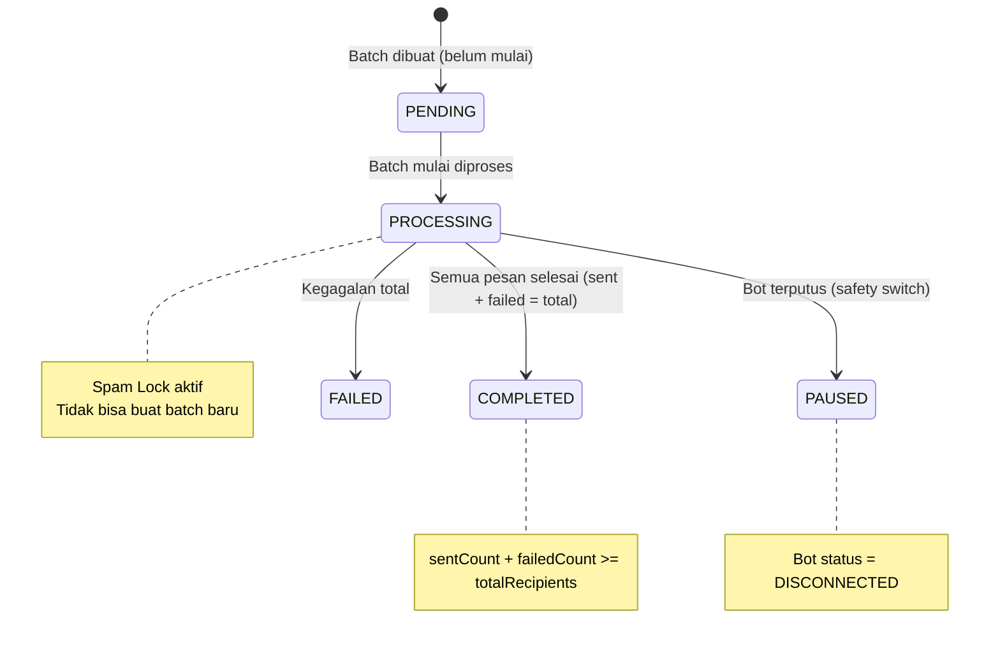

### 5.5 Proses Pemrosesan oleh Worker

Setiap pekerjaan (job) diproses oleh Worker dengan alur berikut:

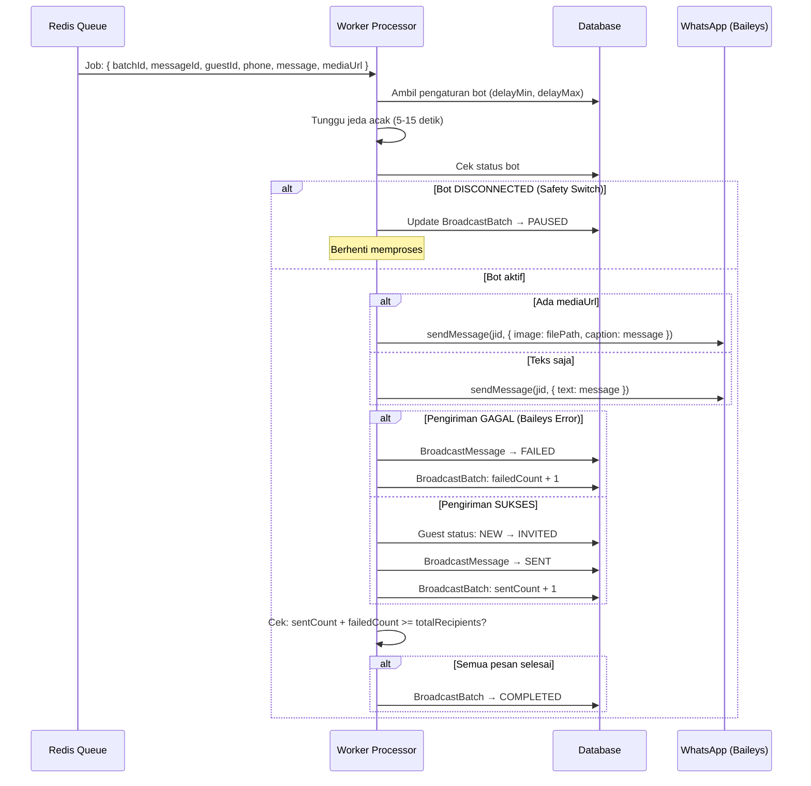

> **Mekanisme Retry:** Jika pengiriman gagal karena kesalahan umum (bukan kesalahan Baileys), sistem akan mencoba ulang hingga **3 kali** dengan backoff eksponensial (30s → 60s → 120s). Setelah 3 kali gagal, pesan ditandai `FAILED`.

### 5.6 Sistem Tindak Lanjut (Follow-up)

Follow-up broadcast menargetkan tamu yang **sudah diundang** tetapi belum melakukan RSVP. Sistem menyaring tamu dengan status `INVITED` atau `OPENED` — tamu yang sudah berstatus `SUBMITTED`, `GOING`, atau `NOT_GOING` **dikecualikan** secara otomatis.

**Endpoint Penerima Follow-up:** `GET /api/events/:eventId/broadcasts/follow-ups/recipients`

**Endpoint Kirim Follow-up:** `POST /api/events/:eventId/broadcasts/follow-ups`

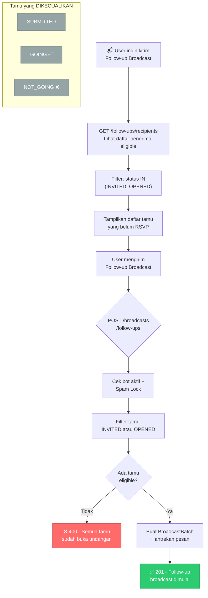

### 5.7 Daftar Endpoint Broadcast

| Metode | Endpoint | Deskripsi |
|---|---|---|
| `GET` | `/api/events/:eventId/broadcasts/preview` | Pratayang templat dengan data asli |
| `POST` | `/api/events/:eventId/broadcasts` | Buat & mulai siaran baru |
| `GET` | `/api/events/:eventId/broadcasts/follow-ups/recipients` | Daftar penerima follow-up |
| `POST` | `/api/events/:eventId/broadcasts/follow-ups` | Kirim siaran tindak lanjut |
| `GET` | `/api/events/:eventId/broadcasts` | Daftar seluruh batch siaran |
| `GET` | `/api/events/:eventId/broadcasts/:id` | Detail batch + statistik |
| `GET` | `/api/events/:eventId/broadcasts/:id/messages` | Daftar pesan dalam batch |

---

## 6. Alur RSVP & Konfirmasi Kehadiran Tamu

### 6.1 Membuka Tautan Undangan (Public)

Ketika tamu mengakses tautan undangan (`/invitation/:hash`), sistem mengambil data undangan beserta detail acara dan jadwal rundown. Jika status tamu masih `NEW` atau `INVITED`, status otomatis berubah menjadi `OPENED` dan waktu `openedAt` dicatat.

**Endpoint:** `GET /api/invitation/:hash` *(Publik, tanpa autentikasi)*

**Response (200):**

```json
{
  "success": true,
  "statusCode": 200,
  "message": "Invitation details retrieved",
  "data": {
    "guest": {
      "name": "Budi Santoso",
      "status": "OPENED",
      "openedAt": "2026-07-10T14:30:00.000Z"
    },
    "group": { "id": "uuid", "name": "Wali Murid" },
    "event": {
      "id": "uuid",
      "title": "Wisuda SMK Telkom 2026",
      "eventDate": "2026-07-15T08:00:00.000Z",
      "endDate": "2026-07-15T15:00:00.000Z",
      "venue": "Aula Utama SMK Telkom Malang",
      "description": "...",
      "rundowns": [
        { "order": 1, "title": "Pembukaan", "startTime": "...", "endTime": "..." },
        { "order": 2, "title": "Wisuda", "startTime": "...", "endTime": "..." }
      ]
    }
  }
}
```

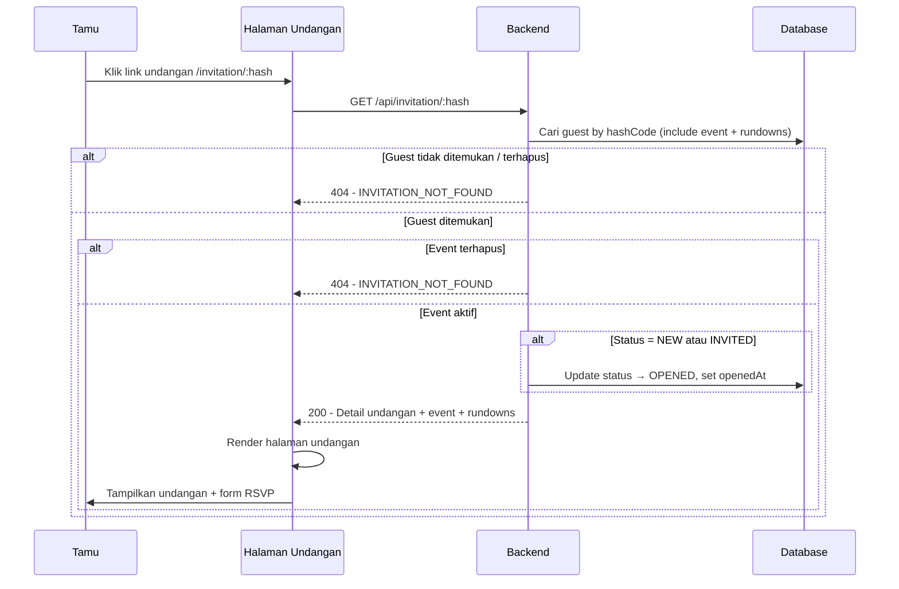

### 6.2 Pengiriman RSVP — Batasan Perubahan 3 Kali

Tamu dapat mengirimkan konfirmasi kehadiran melalui form di halaman undangan. Sistem mengizinkan **maksimal 3 kali perubahan** RSVP menggunakan penghitung `changeCount` pada tabel `GuestRsvp`.

**Endpoint:** `POST /api/invitation/:hash/rsvp` *(Publik)*

**Request Body:**

```json
{
  "attendance": true,
  "message": "InsyaAllah hadir. Terima kasih atas undangannya."
}
```

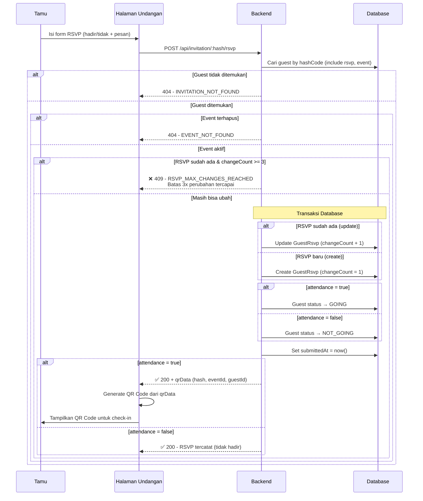

### 6.3 Pembuatan Kode QR Otomatis

Setelah tamu berhasil RSVP dengan `attendance = true`, response API mengembalikan objek `qrData` yang berisi informasi untuk membuat kode QR:

```json
{
  "qrData": {
    "hash": "abc123def456",
    "eventId": "uuid-event",
    "guestId": "uuid-guest"
  }
}
```

> **Tugas Frontend:** Gunakan pustaka pembuat QR (seperti `qrcode.react` atau `qr-code-styling`) untuk merender kode QR dari `qrData.hash`. Kode QR ini yang akan dipindai oleh Event Admin saat check-in di lokasi acara.

```mermaid
graph TD
    A["Tamu RSVP<br/>attendance = true"] --> B["API mengembalikan<br/>qrData"]
    B --> C["Frontend menerima:<br/>hash, eventId, guestId"]
    C --> D["Render QR Code<br/>(isi: hash)"]
    D --> E["Tamu menyimpan/<br/>screenshot QR Code"]
    E --> F["QR siap dipindai<br/>oleh Event Admin"]

    style D fill:#9B59B6,stroke:#8E44AD,color:#fff
    style F fill:#2ECC71,stroke:#27AE60,color:#fff
```

---

## 7. Alur Validasi Operasional di Lapangan

Modul ini khusus untuk pengguna dengan peran `EVENT_ADMIN` yang bertugas di lokasi acara. Seluruh endpoint dilindungi oleh `JwtAuthGuard` dan `RolesGuard(EVENT_ADMIN)`.

### 7.1 Pemeriksaan Masuk (Check-in)

Event Admin dapat melakukan check-in tamu melalui dua metode:

1. **Pemindaian QR Code** — menggunakan kamera perangkat untuk memindai kode QR yang ditunjukkan tamu.
2. **Konfirmasi Manual** — mencari tamu berdasarkan nama/nomor HP, lalu konfirmasi secara manual menggunakan `guestId`.

**Endpoint QR:** `POST /event-admin/checkin/qr`  
**Request Body:** `{ "hash": "abc123def456" }`

**Endpoint Manual:** `POST /event-admin/checkin/manual`  
**Request Body:** `{ "guestId": "uuid-guest-xxx" }`

```mermaid
sequenceDiagram
    participant EA as Event Admin
    participant FE as Frontend
    participant API as Backend
    participant DB as Database

    Note over EA,FE: Metode 1: QR Scan
    EA->>FE: Pindai QR Code tamu
    FE->>API: POST /event-admin/checkin/qr { hash }

    API->>DB: Cari EventAdminAssignment (adminId)
    alt Admin tidak di-assign
        API-->>FE: 403 - EVENT_ADMIN_003
    end

    API->>DB: Cari Guest by hashCode
    alt Guest tidak valid / bukan event ini
        API-->>FE: 404 - GUEST_001
    end

    API->>DB: Buat GuestConfirmation (ARRIVAL, QR_SCAN)
    alt Sudah pernah check-in (unique constraint)
        API-->>FE: ❌ 409 - CONFIRMATION_001<br/>Tamu sudah check-in
    else Belum check-in
        API-->>FE: ✅ 201 - Check-in berhasil
    end

    Note over EA,FE: Metode 2: Manual
    EA->>FE: Cari tamu → pilih → konfirmasi
    FE->>API: POST /event-admin/checkin/manual { guestId }
    Note over API,DB: Alur sama, method = MANUAL
```

### 7.2 Logika Pengambilan Snack — Validasi Check-in Wajib

Sistem menerapkan aturan ketat: tamu **harus sudah melakukan check-in** (memiliki `GuestConfirmation` tipe `ARRIVAL`) sebelum dapat mengklaim snack. Jika belum check-in, klaim ditolak dengan kode galat 409.

**Endpoint QR:** `POST /event-admin/snack/qr`  
**Endpoint Manual:** `POST /event-admin/snack/manual`

```mermaid
graph TD
    A["🍪 Event Admin memproses<br/>klaim snack tamu"] --> B{"Metode?"}
    B -->|QR Scan| C["POST /event-admin/snack/qr<br/>{ hash }"]
    B -->|Manual| D["POST /event-admin/snack/manual<br/>{ guestId }"]
    
    C --> E["Cari admin assignment<br/>+ data tamu"]
    D --> E
    
    E --> F{"Tamu valid &<br/>dari event ini?"}
    F -->|Tidak| G["❌ 404 - GUEST_001<br/>Tamu tidak valid"]
    F -->|Ya| H{"Tamu sudah<br/>check-in (ARRIVAL)?"}
    H -->|Tidak| I["❌ 409 - CONFIRMATION_003<br/>Tamu belum check-in.<br/>Klaim snack ditolak."]
    H -->|Ya| J{"Sudah pernah<br/>klaim snack?"}
    J -->|Ya| K["❌ 409 - CONFIRMATION_001<br/>Sudah klaim sebelumnya"]
    J -->|Tidak| L["Buat GuestConfirmation<br/>(SNACK)"]
    L --> M["✅ 201 - Klaim snack<br/>berhasil dikonfirmasi"]

    style G fill:#FF6B6B,stroke:#CC5555,color:#fff
    style I fill:#FF6B6B,stroke:#CC5555,color:#fff
    style K fill:#FF6B6B,stroke:#CC5555,color:#fff
    style M fill:#2ECC71,stroke:#27AE60,color:#fff
```

### 7.3 Diagram Alur Operasional Lengkap di Lapangan

```mermaid
graph TD
    subgraph "Fase 1: Kedatangan Tamu"
        T1["🚶 Tamu tiba di lokasi"]
        T1 --> T2["Tunjukkan QR Code<br/>ke Event Admin"]
        T2 --> T3{"Check-in<br/>(ARRIVAL)"}
        T3 -->|Berhasil| T4["✅ Tercatat hadir"]
        T3 -->|Sudah pernah| T5["⚠️ Duplikat ditolak"]
    end

    subgraph "Fase 2: Klaim Snack"
        T4 --> T6["Tamu ke meja snack"]
        T6 --> T7{"Klaim Snack<br/>(SNACK)"}
        T7 -->|Sudah check-in| T8["✅ Snack diberikan"]
        T7 -->|Belum check-in| T9["❌ Ditolak"]
        T7 -->|Sudah klaim| T10["⚠️ Duplikat ditolak"]
    end

    style T4 fill:#2ECC71,stroke:#27AE60,color:#fff
    style T8 fill:#2ECC71,stroke:#27AE60,color:#fff
    style T5 fill:#F39C12,stroke:#D68910,color:#fff
    style T9 fill:#FF6B6B,stroke:#CC5555,color:#fff
    style T10 fill:#F39C12,stroke:#D68910,color:#fff
```

### 7.4 Endpoint Event Admin Lengkap

| Metode | Endpoint | Deskripsi |
|---|---|---|
| `POST` | `/event-admin/checkin/qr` | Check-in via QR Code |
| `POST` | `/event-admin/checkin/manual` | Check-in manual via guestId |
| `POST` | `/event-admin/snack/qr` | Klaim snack via QR Code |
| `POST` | `/event-admin/snack/manual` | Klaim snack manual via guestId |
| `GET` | `/event-admin/guests` | Daftar tamu (dengan pencarian) |
| `GET` | `/event-admin/guests/scan/:hash` | Status tamu berdasarkan QR hash (read-only) |

---

## 8. Alur Statistik & Unduh Laporan

### 8.1 Dashboard Statistik Acara

Dashboard menampilkan ringkasan data real-time yang dapat diakses oleh `EVENT_ADMIN` maupun `USER`.

**Endpoint:** `GET /api/admin/stats/:eventId`  
**Guard:** JwtAuth + RolesGuard(`EVENT_ADMIN`, `USER`)

**Response (200):**

```json
{
  "success": true,
  "statusCode": 200,
  "message": "Berhasil mengambil statistik event",
  "data": {
    "totalGuests": 150,
    "totalGoing": 98,
    "totalCheckIn": 75,
    "totalSouvenir": 60
  }
}
```

```mermaid
graph TD
    A["📊 User/Admin<br/>membuka Dashboard"] --> B{"GET /api/admin<br/>/stats/:eventId"}
    B --> C["Hitung total tamu<br/>(aktif, deletedAt = null)"]
    B --> D["Hitung status GOING<br/>(RSVP hadir)"]
    B --> E["Hitung total Check-in<br/>(confirmationType = ARRIVAL)"]
    B --> F["Hitung total Souvenir/Snack<br/>(confirmationType = SOUVENIR)"]
    C --> G["✅ Response: totalGuests,<br/>totalGoing, totalCheckIn,<br/>totalSouvenir"]
    D --> G
    E --> G
    F --> G

    style G fill:#2ECC71,stroke:#27AE60,color:#fff
```

### 8.2 Pencarian Tamu oleh Admin

Endpoint ini digunakan untuk mencari tamu secara manual, mendukung pencarian berdasarkan nama atau nomor ponsel dengan pagination.

**Endpoint:** `GET /api/admin/guests/:eventId`  
**Query Parameters:**

| Parameter | Tipe | Default | Deskripsi |
|---|---|---|---|
| `search` | `string` | — | Kata kunci pencarian (nama/phone) |
| `page` | `number` | `1` | Nomor halaman |
| `limit` | `number` | `10` | Jumlah per halaman |

**Response (200):**

```json
{
  "success": true,
  "statusCode": 200,
  "message": "Berhasil mencari data tamu",
  "data": [ "...daftar tamu..." ],
  "meta": {
    "total": 150,
    "page": 1,
    "limit": 10,
    "totalPages": 15
  }
}
```

### 8.3 Unduh Laporan Data Tamu (Export Excel)

Sistem menghasilkan berkas Excel (.xlsx) yang lengkap dengan dua lembar kerja (sheet):

**Endpoint:** `GET /api/admin/guests/:eventId/export`

**Sheet 1 — Guest Data:**

| Kolom | Deskripsi |
|---|---|
| No | Nomor urut |
| Group | Nama grup tamu |
| Name | Nama tamu |
| Phone | Nomor ponsel |
| Status | Status tamu (NEW/INVITED/OPENED/GOING/NOT_GOING) |
| Opened At | Waktu membuka undangan |
| RSVP Status | GOING / NOT_GOING / NO_RSVP |
| RSVP Time | Waktu submit RSVP |
| RSVP Message | Pesan dari tamu |
| RSVP Changes | Jumlah perubahan RSVP |
| Check-In Status | YES / NO |
| Check-In Time | Waktu check-in |
| Check-In Method | QR_SCAN / MANUAL |
| Checked-In By | Nama admin yang check-in |
| Snack Status | YES / NO |
| Snack Time | Waktu klaim snack |
| Snack Method | QR_SCAN / MANUAL |
| Snack Given By | Nama admin yang memberikan |

**Sheet 2 — Summary:**

| Metrik | Contoh Nilai |
|---|---|
| Event Name | Wisuda SMK Telkom 2026 |
| Total Guests | 150 |
| Status: NEW | 10 |
| Status: INVITED | 25 |
| Status: OPENED | 17 |
| Total GOING | 98 |
| Total NOT GOING | 30 |
| Total NO RSVP | 22 |
| Total Checked-In | 75 |
| Total Snack Claimed | 60 |
| Attendance Rate (vs GOING) | 76.53% |

```mermaid
sequenceDiagram
    participant FE as Frontend
    participant API as Backend
    participant DB as Database

    FE->>API: GET /api/admin/guests/:eventId/export
    API->>DB: Cek event ada
    API->>DB: Ambil SEMUA guest + group + rsvp + confirmations

    Note over API: Pembuatan Berkas Excel
    API->>API: 1. Buat Sheet "Guest Data" (18 kolom)
    API->>API: 2. Isi data baris per tamu
    API->>API: 3. Buat Sheet "Summary" (ringkasan statistik)
    API->>API: 4. Hitung: attendance rate, total per status

    API-->>FE: Response: application/xlsx<br/>Content-Disposition: attachment
    FE->>FE: Browser mengunduh berkas .xlsx
```

> **Catatan untuk Frontend:** Endpoint ini mengembalikan respons berupa stream file langsung (bukan JSON). Gunakan teknik download blob: `window.open()` atau `fetch` dengan response type `blob` untuk mengunduh berkas.

---

## 9. Fitur Tambahan & Alur Pelengkap

### 9.1 Manajemen Super Admin

Super Admin memiliki akses penuh ke manajemen pengguna dan bot WhatsApp.

#### 9.1.1 Manajemen Pengguna

| Metode | Endpoint | Deskripsi |
|---|---|---|
| `GET` | `/super-admin/users` | Daftar pengguna (paginated + search) |
| `GET` | `/super-admin/users/trash` | Daftar pengguna yang dihapus |
| `GET` | `/super-admin/users/:id` | Detail pengguna |
| `PUT` | `/super-admin/users/:id/role` | Ubah peran pengguna |
| `PUT` | `/super-admin/users/:id/status` | Toggle aktif/nonaktif |
| `DELETE` | `/super-admin/users/:id` | Soft-delete pengguna |
| `POST` | `/super-admin/event-admins/assign` | Assign Event Admin ke acara |

**Aturan Bisnis Pengubahan Peran:**

- Super Admin **tidak dapat** mengubah peran Super Admin lainnya.
- Super Admin **tidak dapat** menurunkan perannya sendiri (self-demotion).
- Super Admin **tidak dapat** menghapus akun Super Admin lainnya.
- Super Admin **tidak dapat** menghapus akunnya sendiri.

```mermaid
graph TD
    A["👑 Super Admin<br/>mengubah peran user"] --> B{"PUT /super-admin<br/>/users/:id/role"}
    B --> C["Cari target user"]
    C --> D{"Target = Super Admin<br/>& bukan diri sendiri?"}
    D -->|Ya| E["❌ 403 - USER_003<br/>Tidak bisa ubah SA lain"]
    D -->|Tidak| F{"Target = diri sendiri<br/>& role baru ≠ SA?"}
    F -->|Ya| G["❌ 403 - USER_004<br/>Tidak bisa turunkan diri"]
    F -->|Tidak| H["Update role"]
    H --> I["Catat ke AuditLog"]
    I --> J["✅ 200 - Role berhasil diubah"]

    style E fill:#FF6B6B,stroke:#CC5555,color:#fff
    style G fill:#FF6B6B,stroke:#CC5555,color:#fff
    style J fill:#2ECC71,stroke:#27AE60,color:#fff
```

#### 9.1.2 Manajemen Bot WhatsApp

| Metode | Endpoint | Deskripsi |
|---|---|---|
| `GET` | `/super-admin/bot/status` | Status koneksi bot + heartbeat info |
| `GET` | `/super-admin/bot/qr` | Ambil QR code untuk pairing |
| `PUT` | `/super-admin/bot/settings` | Ubah pengaturan delay pesan |
| `POST` | `/super-admin/bot/disconnect` | Putuskan koneksi bot |

**Siklus Hidup Status Bot (BotStatus):**

```mermaid
stateDiagram-v2
    [*] --> DISCONNECTED : Status awal
    DISCONNECTED --> CONNECTING : Worker memulai koneksi
    CONNECTING --> QR_REQUIRED : QR Code dihasilkan
    QR_REQUIRED --> CONNECTED : User scan QR berhasil
    CONNECTED --> DISCONNECTED : Koneksi terputus / Admin disconnect
    CONNECTED --> DISCONNECTED : Watchdog: heartbeat stale (5 menit)
    CONNECTING --> ERROR : Kesalahan koneksi
    ERROR --> DISCONNECTED : Worker retry

    note right of CONNECTED : Heartbeat setiap 30 detik
    note right of QR_REQUIRED : QR disimpan ke DB (base64)
```

### 9.2 Sistem Watchdog Bot

Sistem watchdog berjalan sebagai **Cron Job setiap 1 menit** dan memonitor kesehatan koneksi bot WhatsApp. Jika heartbeat terakhir lebih dari **5 menit** yang lalu, watchdog otomatis melakukan reset: menghapus folder sesi, mengubah status DB ke `DISCONNECTED`, dan Worker akan melakukan koneksi ulang pada polling berikutnya.

```mermaid
sequenceDiagram
    participant CRON as Cron Job (1 menit)
    participant API as Main API
    participant DB as Database
    participant FS as Filesystem
    participant WK as Worker

    loop Setiap 1 menit
        CRON->>API: checkHeartbeat()
        API->>DB: Ambil data bot

        alt Status ≠ CONNECTED atau tidak ada heartbeat
            Note over API: Skip (tidak perlu tindakan)
        else Status = CONNECTED
            alt Dalam periode cooldown (3 menit setelah restart)
                Note over API: Skip (cooldown)
            else Di luar cooldown
                API->>API: Hitung: now - lastHeartbeat
                alt Stale < 5 menit
                    Note over API: OK - Bot sehat
                else Stale >= 5 menit
                    Note over API,FS: TRIGGER: restartBot()
                    API->>FS: Hapus folder wa-session
                    API->>FS: Buat ulang folder kosong
                    API->>DB: Status → DISCONNECTED
                    Note over WK: Worker mendeteksi DISCONNECTED<br/>pada health check berikutnya<br/>→ self-reconnect
                end
            end
        end
    end
```

### 9.3 Grup Tamu (Guest Groups)

Tamu dapat dikelompokkan ke dalam grup untuk memudahkan pengelolaan dan targeting siaran pesan. Grup dibuat otomatis saat impor Excel jika nama grup belum ada. Tabel `GuestGroup` memiliki relasi ke `Event` dan `Guest`.

**Struktur Data GuestGroup:**

```
GuestGroup {
  id: UUID
  eventId: UUID
  name: String
  createdAt: DateTime
  updatedAt: DateTime
  deletedAt: DateTime?    // Soft delete
}
```

### 9.4 Pesan RSVP Acara (EventRsvpMessage)

Pemilik acara dapat mengonfigurasi pesan khusus yang ditampilkan setelah tamu mengisi RSVP:

```
EventRsvpMessage {
  id: UUID
  eventId: UUID (unique)
  goingMessage: String      // Pesan untuk tamu yang hadir
  notGoingMessage: String   // Pesan untuk tamu yang tidak hadir
}
```

### 9.5 Sinkronisasi Offline (OfflineSyncQueue)

Sistem mendukung operasional di lokasi dengan koneksi internet tidak stabil melalui mekanisme antrean sinkronisasi offline:

```
OfflineSyncQueue {
  id: UUID
  deviceId: String          // ID perangkat
  adminId: UUID
  actionType: String        // Jenis aksi (check-in, snack claim, dll.)
  payload: JSON             // Data aksi
  status: PENDING | SYNCED | CONFLICT | FAILED
  localTimestamp: DateTime  // Waktu aksi di perangkat lokal
  syncedAt: DateTime?       // Waktu berhasil disinkronkan
  conflictNote: String?     // Catatan jika terjadi konflik
}
```

### 9.6 Audit Log

Seluruh aksi penting dicatat ke tabel `AuditLog` untuk keperluan pelacakan dan keamanan:

```
AuditLog {
  id: UUID
  userId: UUID?
  action: CREATE | UPDATE | DELETE | LOGIN | LOGOUT | ROLE_CHANGE | QR_SCAN | BOT_CONNECT | BOT_DISCONNECT
  entityType: String       // "User", "Event", "WaBotConnection", dll.
  entityId: UUID?
  oldValues: JSON?         // Nilai sebelum perubahan
  newValues: JSON?         // Nilai setelah perubahan
  ipAddress: String?
  userAgent: String?
  createdAt: DateTime
}
```

### 9.7 Tipe Konfirmasi (ConfirmationType)

Sistem mendukung tiga jenis konfirmasi di lapangan:

| Tipe | Kode Enum | Deskripsi | Prasyarat |
|---|---|---|---|
| Kedatangan | `ARRIVAL` | Check-in tamu di gerbang | — (tanpa prasyarat) |
| Makanan Ringan | `SNACK` | Klaim snack/makanan ringan | Wajib sudah `ARRIVAL` |
| Suvenir | `SOUVENIR` | Klaim suvenir/goodie bag | — |

**Constraint unik:** `@@unique([guestId, confirmationType])` — setiap tamu hanya bisa melakukan satu kali konfirmasi per tipe.

---

## Lampiran: Referensi Cepat API

### Format Response Standar

Semua respons API mengikuti format konsisten:

**Respons Sukses:**

```json
{
  "success": true,
  "statusCode": 200,
  "message": "Deskripsi pesan",
  "data": { "...payload data..." },
  "meta": { "...pagination info (opsional)..." }
}
```

**Respons Galat:**

```json
{
  "success": false,
  "statusCode": 400,
  "message": "Deskripsi kesalahan",
  "error": {
    "code": "ERROR_CODE",
    "details": [ "...detail tambahan..." ]
  }
}
```

### Daftar Kode Galat

| Kode | HTTP Status | Deskripsi |
|---|---|---|
| `AUTH_001` | 401 | Kredensial tidak valid |
| `AUTH_002` | 401 | Kata sandi lama tidak sesuai |
| `USER_001` | 404 | Pengguna tidak ditemukan |
| `USER_002` | 409 | Email sudah terdaftar |
| `USER_003` | 403 | Tidak bisa ubah peran Super Admin lain |
| `USER_004` | 403 | Tidak bisa turunkan peran sendiri |
| `USER_005` | 403 | Tidak bisa hapus akun sendiri |
| `USER_006` | 403 | Tidak bisa hapus akun Super Admin |
| `EVENT_001` | 404 | Acara tidak ditemukan |
| `EVENT_ADMIN_002` | 409 | Email Event Admin sudah terdaftar |
| `EVENT_ADMIN_003` | 403 | Admin belum di-assign ke event |
| `EVENT_ADMIN_004` | 404 | Admin tidak ditemukan pada event |
| `GUEST_001` | 404 | Tamu tidak ditemukan |
| `GUEST_002` | 400 | Nomor tidak terdaftar di WhatsApp |
| `BROADCAST_001` | 400 | groupId wajib untuk targetType GROUP |
| `BROADCAST_002` | 400 | Bot WhatsApp tidak siap |
| `BROADCAST_003` | 400 | Tidak ada tamu eligible |
| `BROADCAST_004` | 404 | Batch siaran tidak ditemukan |
| `BROADCAST_PROCESSING_ERROR` | 409 | Siaran sedang berjalan (spam lock) |
| `CONFIRMATION_001` | 409 | Tamu sudah klaim sesi ini (duplikat) |
| `CONFIRMATION_003` | 409 | Tamu belum check-in (klaim snack ditolak) |
| `INVITATION_NOT_FOUND` | 404 | Undangan tidak ditemukan |
| `RSVP_MAX_CHANGES_REACHED` | 409 | Batas perubahan RSVP (3x) tercapai |
| `BOT_001` | 400 | delayMin > delayMax |

### Normalisasi Nomor Ponsel

Seluruh nomor ponsel yang masuk ke sistem akan dinormalisasi ke format E.164:

| Input | Output |
|---|---|
| `081234567890` | `+6281234567890` |
| `+6281234567890` | `+6281234567890` |
| `6281234567890` | `+6281234567890` |

### Header Autentikasi

Seluruh endpoint yang tidak ditandai `@Public()` memerlukan header:

```
Authorization: Bearer <accessToken>
```

Token akses memiliki masa berlaku **15 menit** dan refresh token **7 hari**.

---

## 📄 License

UNLICENSED — Internal project for SMK Telkom Malang.
