# 📖 Panduan Alur Simpel — UKSTM-32 Digital Invitation

> Panduan ini menjelaskan alur kerja aplikasi secara sederhana.

---

## 🏗️ Gambaran Besar Sistem

Sistem ini terdiri dari **4 bagian utama** yang saling bekerja sama:

```
Pengguna (Browser) → Backend (Otak Utama) → Database (Penyimpanan Data)
                                           → Worker (Pengirim Pesan WhatsApp)
```

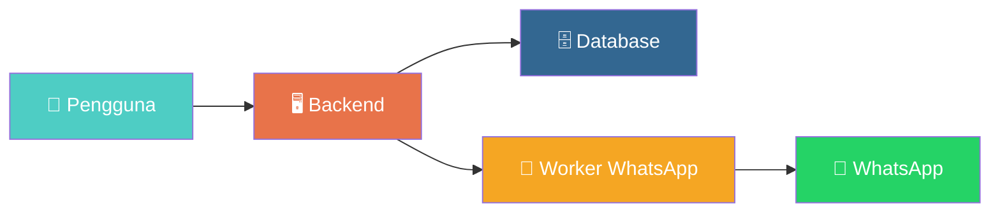

---

## 👤 1. Pendaftaran & Masuk

### Daftar Akun Baru

```
Isi Form (nama, email, HP, password)
  → Sistem cek email sudah dipakai atau belum
    → Kalau sudah → ❌ Ditolak "Email sudah ada"
    → Kalau belum → ✅ Akun dibuat → Dapat token akses → Masuk ke aplikasi
```

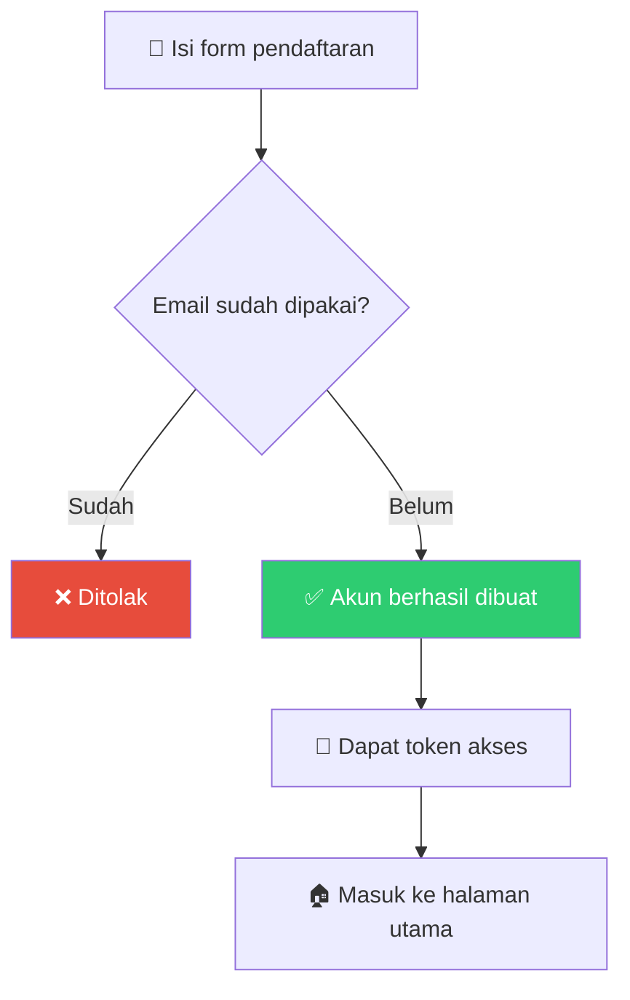

### Login

```
Isi email & password
  → Sistem cocokkan data
    → Kalau salah → ❌ "Kredensial tidak valid"
    → Kalau benar → Cek akun aktif
      → Tidak aktif → ❌ "Akun nonaktif"
      → Aktif → ✅ Login berhasil → Dapat token
        → Super Admin → Halaman kelola pengguna & bot
        → User biasa → Halaman daftar acara
        → Event Admin → Langsung ke halaman operasional acara
```

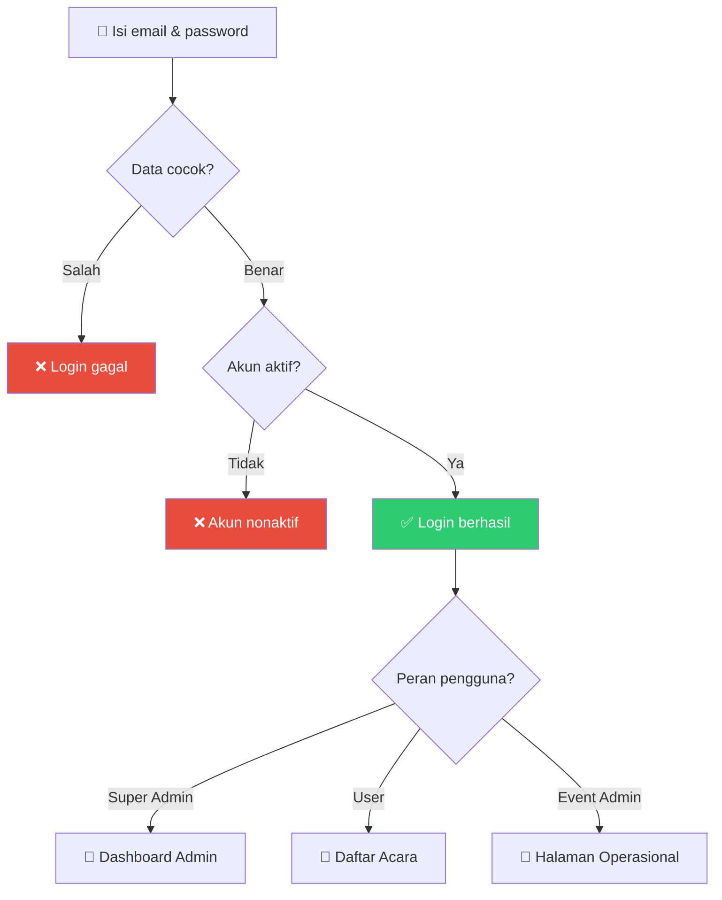

### Ganti Password

```
Isi password lama + password baru
  → Sistem cek password lama cocok
    → Tidak cocok → ❌ "Password lama salah"
    → Cocok → ✅ Password diperbarui
```

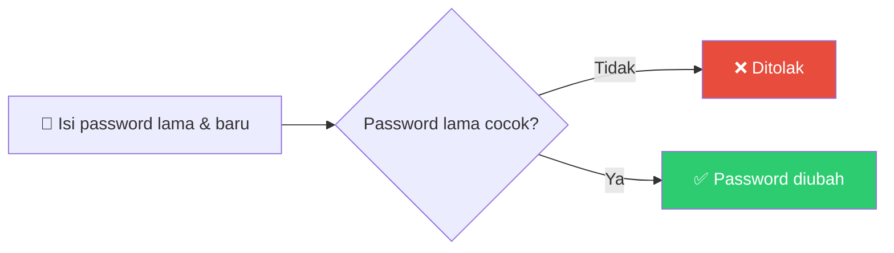

---

## 🎭 2. Tiga Peran Pengguna

```
👑 Super Admin  → Kelola semua pengguna + Bot WhatsApp
🧑 User         → Buat acara (maks 10) + Kelola tamu + Kirim undangan
🎫 Event Admin  → Check-in tamu + Bagi snack (di lokasi acara)
```

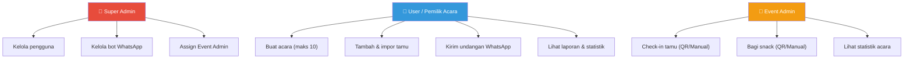

---

## 📅 3. Buat & Kelola Acara

### Buat Acara Baru

```
Klik "Buat Acara" → Isi judul, tanggal, lokasi, deskripsi
  → Sistem cek jumlah acara user
    → Sudah 10 acara → ❌ "Maksimal 10 acara"
    → Belum 10 → ✅ Acara berhasil dibuat
```

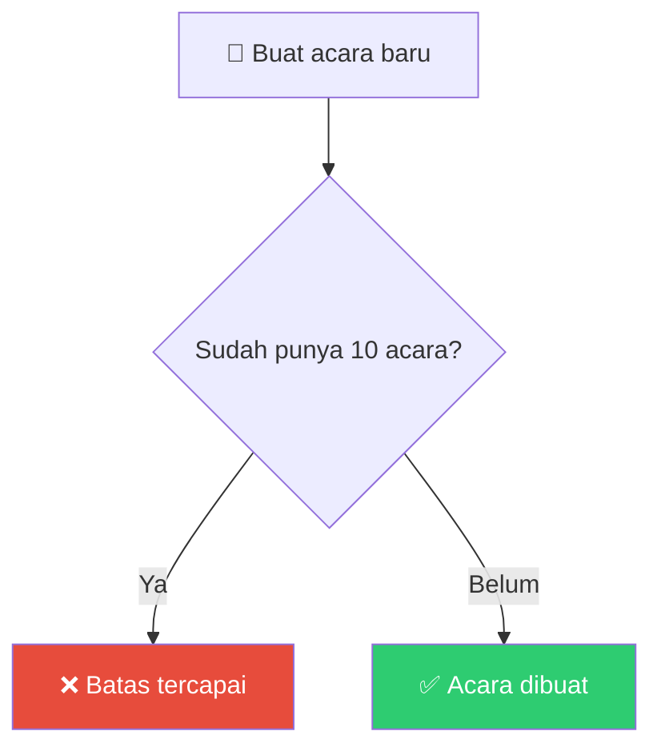

### Kelola Acara

```
Lihat daftar acara → Pilih acara → Edit / Hapus
  → Hapus = Soft Delete (data masih tersimpan, masuk ke "Sampah")
```

### Daftarkan Event Admin

```
Pemilik acara isi data admin (nama, email, HP, password)
  → Sistem cek email belum dipakai
    → Sudah ada → ❌ "Email sudah terdaftar"
    → Belum → ✅ Akun Event Admin dibuat & ditautkan ke acara
```

---

## 📋 4. Jadwal Acara (Rundown)

### Tambah Rundown

```
Isi judul, deskripsi, waktu mulai, waktu selesai
  → Sistem otomatis tentukan nomor urut (urutan terakhir + 1)
  → ✅ Rundown ditambahkan
```

> **Penting:** Nomor urut ditentukan otomatis oleh sistem, bukan oleh pengguna. Ini mencegah nomor urut ganda.

### Ubah Urutan Rundown

```
Pindahkan rundown ke posisi baru
  → Kalau posisi sudah diisi → Geser yang lain ke bawah
  → ✅ Urutan diperbarui
```

### Hapus Rundown

```
Hapus rundown
  → Sistem otomatis rapatkan urutan (tidak ada celah)
  → Contoh: hapus no.2 → no.3 jadi no.2, no.4 jadi no.3, dst.
```

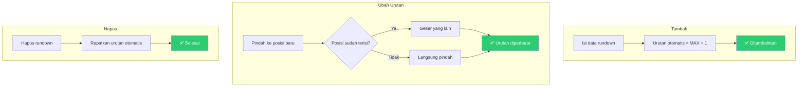

---

## 👥 5. Kelola Tamu

### Perjalanan Status Tamu

Ini adalah siklus hidup status setiap tamu dalam sistem:

```
NEW (baru didaftarkan)
  → INVITED (pesan WA terkirim)
    → OPENED (buka link undangan)
      → GOING (RSVP: hadir) ← bisa bolak-balik maks 3x → NOT_GOING (RSVP: tidak hadir)
```

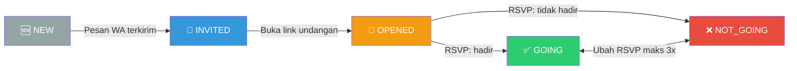

### Tambah Tamu Satu per Satu

```
Isi nama + nomor HP
  → Sistem cek ke WhatsApp: "Nomor ini aktif?"
    → Tidak aktif → ❌ Ditolak "Nomor tidak terdaftar di WA"
    → Aktif → Cek nomor sudah dipakai di acara ini?
      → Sudah → ❌ "Nomor sudah terdaftar"
      → Belum → ✅ Tamu ditambahkan (status: NEW)
                   + Dapat link undangan unik
```

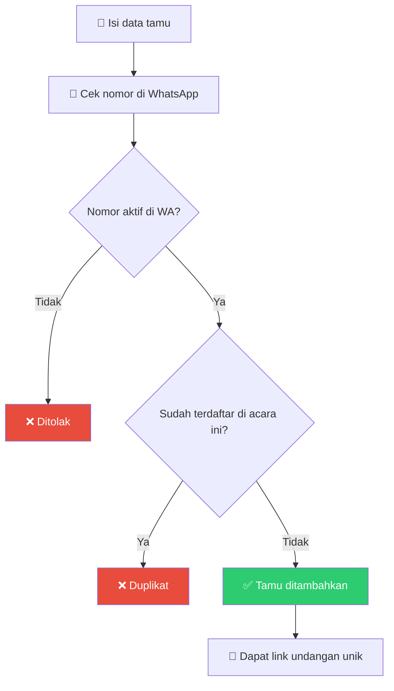

### Impor Tamu dari Excel

Format kolom Excel: **Nama | No. Handphone | Grup**

```
Upload file Excel (.xlsx)
  → Sistem baca baris per baris
    → Baris tanpa nama/HP → ❌ Masuk daftar error
    → Nomor tidak aktif di WA → ❌ Masuk daftar error
    → Nomor duplikat di file → ❌ Masuk daftar error
    → Nomor sudah ada di database → ❌ Masuk daftar error
    → Semua lolos → ✅ Tamu disimpan ke database
  → Hasil: "45 berhasil, 5 gagal" + daftar error per baris
```

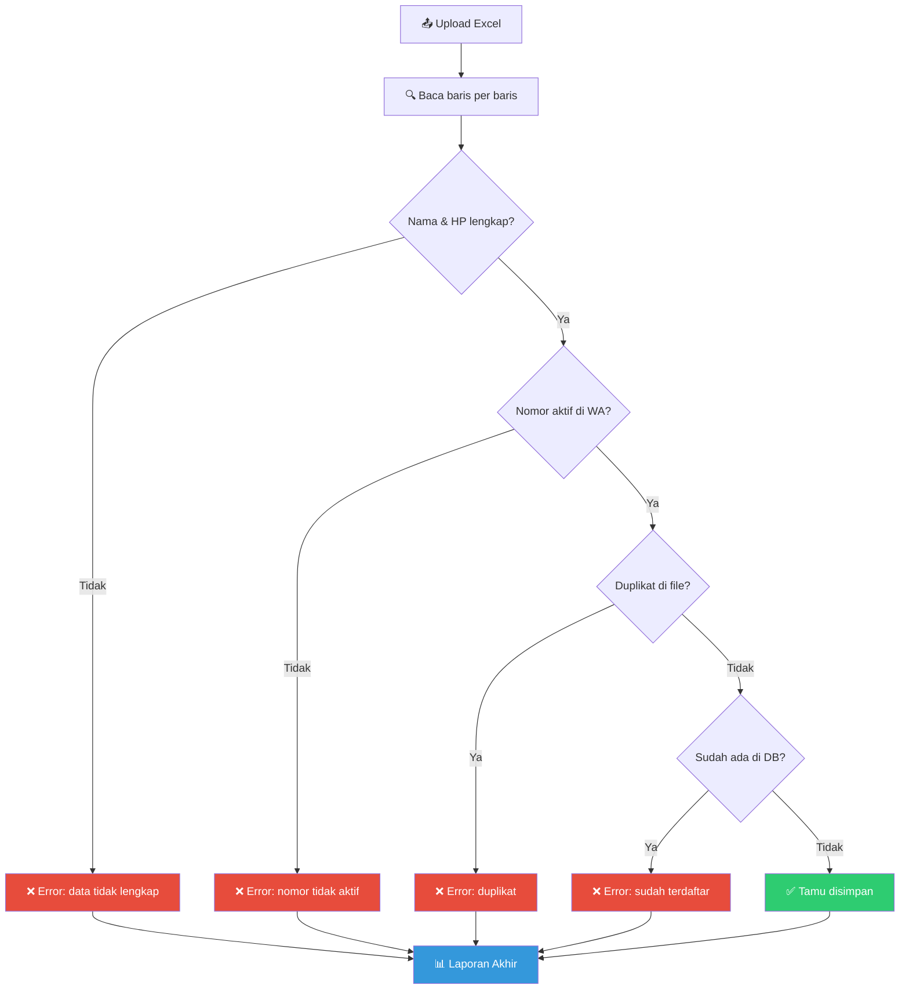

### Edit Tamu — Ganti Nomor HP

```
Edit data tamu → Ganti nomor HP
  → Kalau nomor baru berbeda dari yang lama
    → Status tamu otomatis kembali ke NEW
    → (Karena nomor baru belum pernah dapat undangan)
```

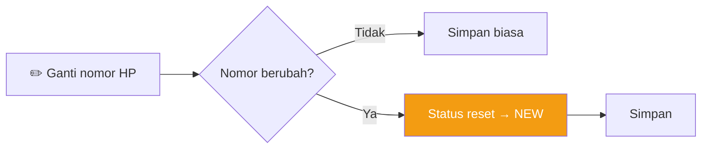

---

## 📢 6. Kirim Undangan WhatsApp (Broadcast)

### Alur Lengkap Pengiriman

```
1. User tulis template pesan (pakai variabel {{ name }}, {{ invitation_link }}, dll.)
2. User lihat preview → Sistem tampilkan contoh pesan dengan data tamu asli
3. User klik "Kirim" → Sistem cek:
   → Bot WA nyala? → Tidak → ❌ "Bot belum siap"
   → Ada siaran yang masih jalan? → Ya → ❌ "Tunggu siaran sebelumnya selesai"
   → Ada tamu yang belum diundang? → Tidak → ❌ "Semua tamu sudah diundang"
   → Semua lolos → ✅ Pesan masuk antrean
4. Worker kirim pesan satu per satu (jeda 5-15 detik per pesan)
5. Setiap pesan terkirim → Status tamu berubah: NEW → INVITED
6. Semua selesai → Batch siaran ditandai "COMPLETED"
```

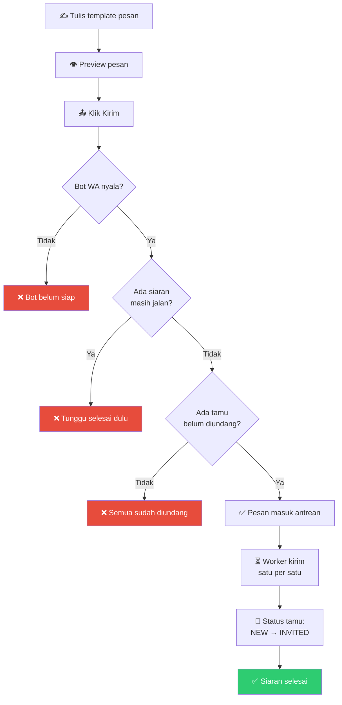

### Variabel Template

```
{{ name }}            → Nama tamu (contoh: "Budi Santoso")
{{ event_title }}     → Judul acara (contoh: "Wisuda SMK Telkom 2026")
{{ event_date }}      → Tanggal acara (contoh: "Selasa, 15 Juli 2026")
{{ invitation_link }} → Link undangan unik tamu
```

### Status Siaran (Batch)

```
PENDING → PROCESSING → COMPLETED
                     → PAUSED (kalau bot mati)
                     → FAILED (gagal total)
```

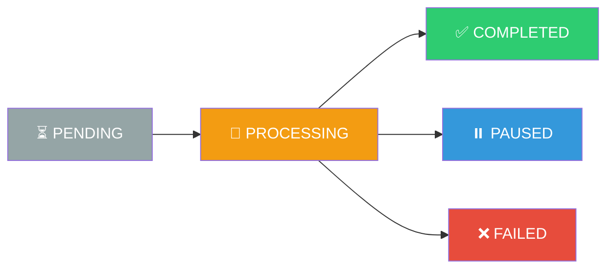

### Follow-up (Tindak Lanjut)

```
Siapa yang dapat follow-up?
  → Tamu berstatus INVITED atau OPENED
  → TIDAK termasuk: tamu yang sudah GOING / NOT_GOING

Alur:
  Lihat daftar penerima follow-up → Tulis pesan baru → Kirim
  → Sama seperti broadcast biasa (cek bot, cek spam lock, dll.)
```

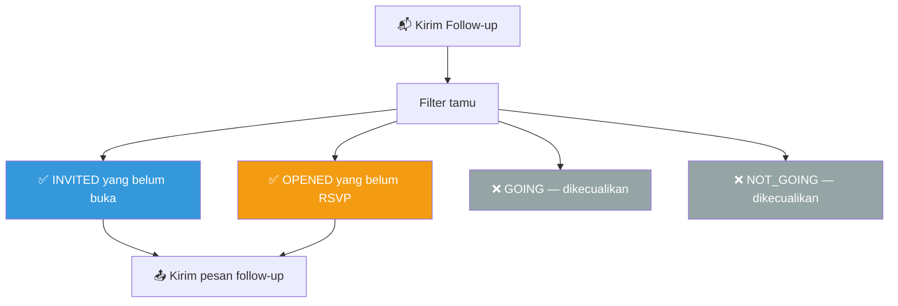

---

## 💌 7. Tamu Buka Undangan & RSVP

### Buka Link Undangan

```
Tamu klik link undangan → Halaman undangan terbuka
  → Tampilkan: nama tamu, detail acara, jadwal rundown
  → Kalau status masih NEW/INVITED → Otomatis berubah ke OPENED
  → Waktu dibuka (openedAt) dicatat
```

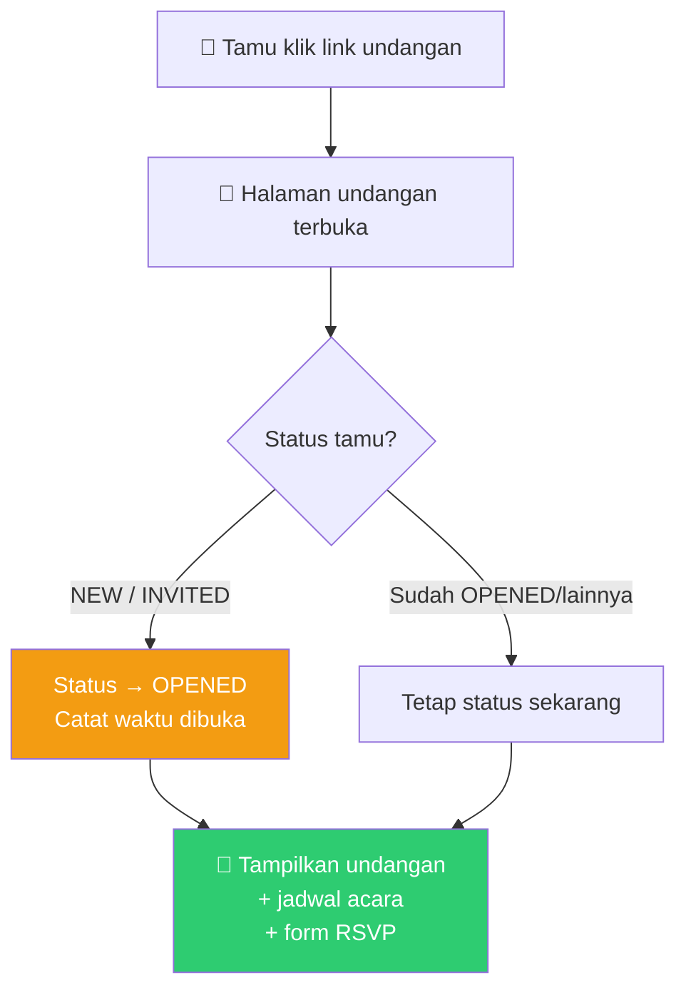

### RSVP (Konfirmasi Kehadiran)

```
Tamu isi form RSVP (hadir/tidak + pesan opsional)
  → Cek: sudah ubah RSVP berapa kali?
    → Sudah 3 kali → ❌ "Batas perubahan tercapai"
    → Belum 3 kali → ✅ RSVP disimpan
      → Hadir → Status → GOING + Dapat QR Code
      → Tidak hadir → Status → NOT_GOING
```

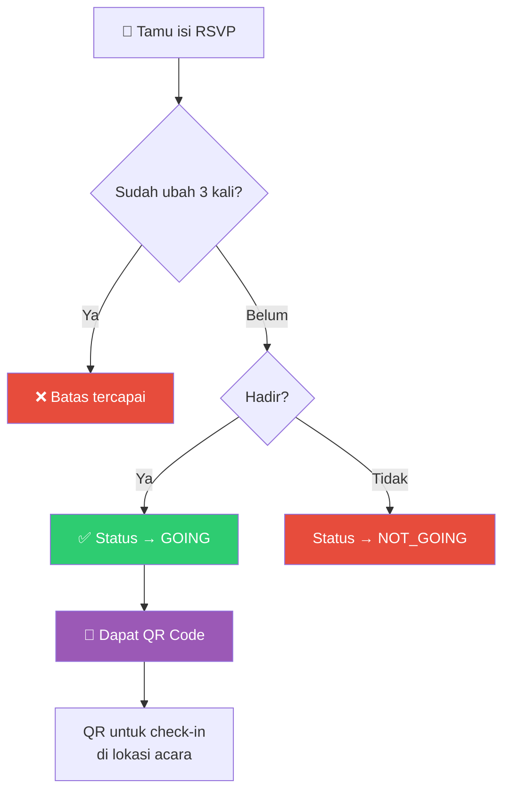

---

## 🎫 8. Hari-H: Operasional di Lokasi Acara

### Check-in Tamu

```
Tamu tiba di lokasi → Tunjukkan QR Code ke Event Admin
  → Admin scan QR (atau cari manual)
    → Tamu valid & belum check-in → ✅ Check-in berhasil
    → Tamu sudah check-in → ❌ "Sudah check-in sebelumnya"
    → Tamu tidak dikenal → ❌ "Data tidak valid"
```

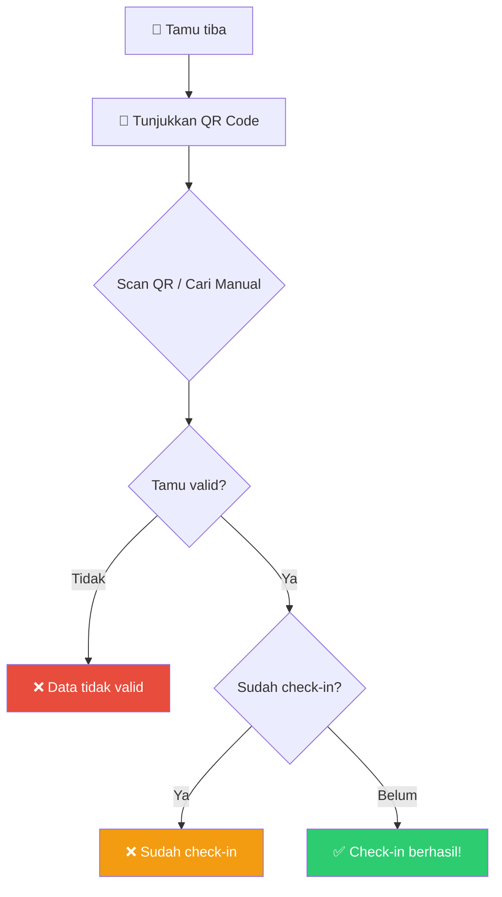

### Klaim Snack (Makanan Ringan)

```
Tamu mau ambil snack → Admin scan QR
  → Cek: sudah check-in belum?
    → BELUM check-in → ❌ "Check-in dulu baru boleh ambil snack!"
    → SUDAH check-in → Cek: sudah ambil snack?
      → Sudah → ❌ "Sudah ambil sebelumnya"
      → Belum → ✅ Snack diberikan
```

> ⚠️ **Aturan Ketat:** Tamu WAJIB check-in dulu sebelum boleh ambil snack. Tidak ada pengecualian.

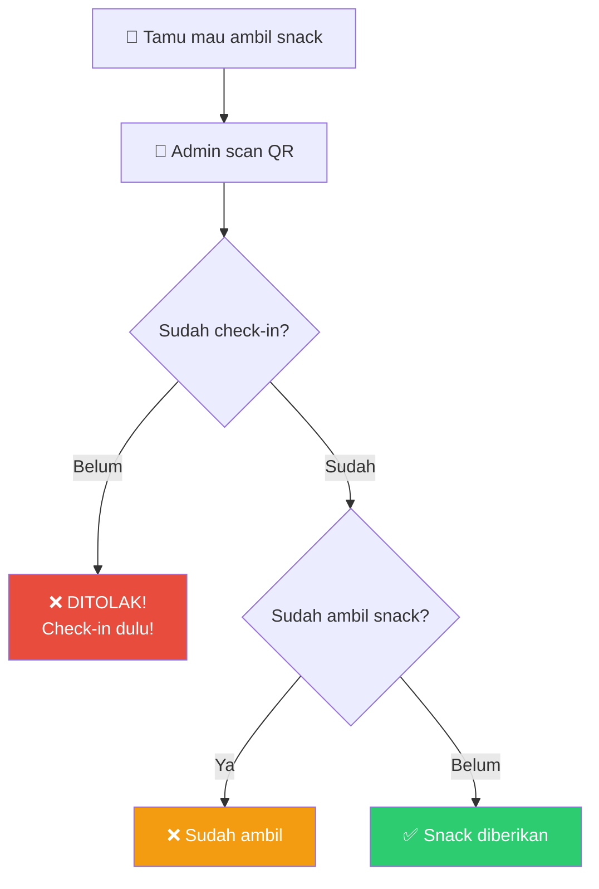

### Alur Lengkap di Lokasi

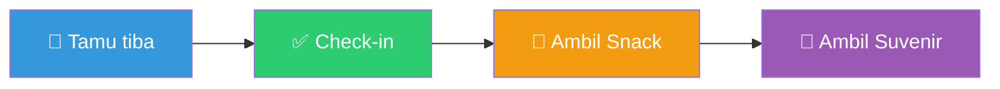

---

## 📊 9. Statistik & Laporan

### Dashboard Statistik

```
Buka halaman statistik → Sistem tampilkan:
  → Total tamu terdaftar
  → Total yang RSVP hadir (GOING)
  → Total yang sudah check-in
  → Total yang sudah ambil snack/suvenir
```

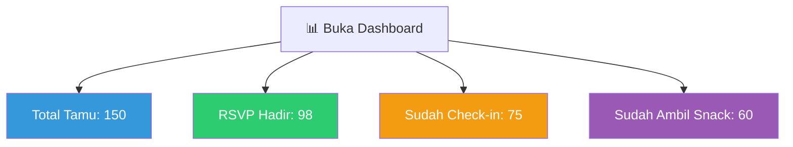

### Unduh Laporan Excel

```
Klik "Export" → Sistem buat file Excel dengan 2 sheet:
  → Sheet 1: Data Tamu (semua detail per tamu)
  → Sheet 2: Ringkasan (total per status, tingkat kehadiran, dll.)
  → Browser otomatis download file .xlsx
```

---

## 🤖 10. Bot WhatsApp (Super Admin)

### Status Bot

```
DISCONNECTED (mati)
  → CONNECTING (sedang nyambung)
    → QR_REQUIRED (scan QR dulu)
      → CONNECTED (nyala & siap kirim pesan)
        → DISCONNECTED (kalau mati / di-disconnect admin)
```

```mermaid
graph LR
    A["🔴 MATI"] --> B["🟡 NYAMBUNG..."]
    B --> C["📷 SCAN QR"]
    C --> D["🟢 NYALA"]
    D --> A

    style A fill:#e74c3c,color:#fff
    style B fill:#f39c12,color:#fff
    style C fill:#9b59b6,color:#fff
    style D fill:#2ecc71,color:#fff
```

### Watchdog (Penjaga Otomatis)

```
Setiap 1 menit, sistem cek:
  → Bot nyala & heartbeat terakhir < 5 menit → ✅ Sehat
  → Bot nyala tapi heartbeat > 5 menit → ⚠️ Bermasalah!
    → Otomatis reset → Worker akan nyambung ulang sendiri
```

---

## 🔄 11. Alur Lengkap Dari Awal Sampai Akhir

Ini adalah perjalanan lengkap dari pendaftaran sampai acara selesai:

```mermaid
graph TD
    A["1️⃣ User daftar akun"] --> B["2️⃣ Login"]
    B --> C["3️⃣ Buat acara baru"]
    C --> D["4️⃣ Isi jadwal rundown"]
    D --> E["5️⃣ Tambah/impor tamu"]
    E --> F["6️⃣ Kirim undangan WA"]
    F --> G["7️⃣ Tamu buka undangan"]
    G --> H["8️⃣ Tamu isi RSVP"]
    H --> I{"Hadir?"}
    I -->|Ya| J["9️⃣ Dapat QR Code"]
    I -->|Tidak| K["Tercatat tidak hadir"]
    J --> L["🔟 Hari H: Check-in pakai QR"]
    L --> M["1️⃣1️⃣ Ambil snack"]
    M --> N["1️⃣2️⃣ Ambil suvenir"]
    N --> O["📊 Lihat statistik & unduh laporan"]

    style A fill:#3498db,color:#fff
    style F fill:#9b59b6,color:#fff
    style J fill:#f39c12,color:#fff
    style L fill:#2ecc71,color:#fff
    style O fill:#e67e22,color:#fff
```

### Versi Teks Sederhana

```
📝 Daftar Akun
  → 🔐 Login
    → 📅 Buat Acara
      → 📋 Atur Jadwal (Rundown)
        → 👥 Tambah Tamu (manual / Excel)
          → 📱 Validasi nomor HP di WhatsApp
            → 📢 Kirim Undangan via WhatsApp
              → 💌 Tamu buka undangan (status: OPENED)
                → 📝 Tamu isi RSVP (hadir/tidak, maks ubah 3x)
                  → 🎫 Kalau hadir: dapat QR Code
                    → ✅ Hari H: Check-in pakai QR
                      → 🍪 Ambil snack (harus sudah check-in!)
                        → 🎁 Ambil suvenir
                          → 📊 Unduh laporan Excel
```

---

## 📌 Catatan Penting untuk Tim Frontend

| No | Hal Penting | Penjelasan |
|----|-------------|------------|
| 1 | **Nomor HP otomatis diformat** | `081xxx` → `+6281xxx` (dilakukan di backend) |
| 2 | **Status tamu berubah otomatis** | NEW → INVITED (saat WA terkirim), INVITED → OPENED (saat buka link) |
| 3 | **RSVP dibatasi 3x perubahan** | Tampilkan peringatan saat sisa perubahan tinggal sedikit |
| 4 | **Snack butuh check-in dulu** | Tampilkan pesan error yang jelas jika belum check-in |
| 5 | **Spam Lock pada broadcast** | Kalau ada siaran berjalan, tombol "Kirim" harus di-disable |
| 6 | **Export Excel = download file** | Bukan JSON biasa, gunakan `window.open()` atau blob download |
| 7 | **Event Admin punya eventId** | Saat login, simpan `eventId` dari response untuk navigasi otomatis |
| 8 | **QR Code dibuat di frontend** | Backend kirim data `{ hash }`, frontend generate QR dari data tersebut |
| 9 | **Maksimal 10 acara per user** | Tampilkan peringatan saat mendekati batas |
| 10 | **Soft delete dimana-mana** | Data tidak benar-benar dihapus, ada fitur "Sampah / Trash" |

---

## 📄 License

UNLICENSED — Internal project for SMK Telkom Malang.
